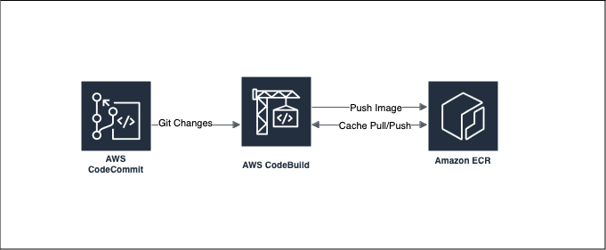

At the time of writing AWS lacks a straightforward guide on creating multi-architecture CodeBuild containers [the one public blogpost](https://aws.amazon.com/blogs/devops/creating-multi-architecture-docker-images-to-support-graviton2-using-aws-codebuild-and-aws-codepipeline/) which exists suggests creating 3 CodeBuild projects -- a far cry from an optimal solution.

My goals for this post are:
- Simplify the AWS architecture -- allowing for easy debugging in the future
- Enchance CodeBuild's speed via cache -- by extension save building time and money

In the above graph, this design is much simpler and easier to understand any changes that developer performs to the Git repository should be pulled by CodeBuild when pressing the `Start Build` button, or you can directly integrate this into CodePipeline

# Pre-requisites
- This post assumes the use of Amazon ECR & AWS CodeBuild
- You need CodeBuild IAM role with `AmazonEC2ContainerRegistryFullAccess` managed policy
- A Git repository GitHub, GitHub Enterprise, GitLab or CodeCommit
- (optional) Integration into CodePipeline for automatic deployments

buildspec.yml
```yaml
version: 0.2

env:
  variables:
    AWS_ECR_REPOSITORY_NAME: "your-ecr-repository-name"#<--- CHANGE ME

phases:
  pre_build:
    commands:
      - echo Checking current tools version
      - docker buildx version
      - echo Setting the env variables..
      - export GIT_TAG=$(git rev-parse --short HEAD)
      - export AWS_ACCOUNT_ID=$(aws sts get-caller-identity --output text --query 'Account')
      - export AWS_REGISTRY_NAME=$AWS_ACCOUNT_ID.dkr.ecr.$AWS_DEFAULT_REGION.amazonaws.com
      - echo Logging in to amazon ECR...
      - aws ecr get-login-password --region $AWS_DEFAULT_REGION | docker login --username AWS --password-stdin $AWS_REGISTRY_NAME
  build:
    commands:
      - echo Build Started on `date`
      - echo Building the docker image...
      - docker buildx create --use --name $AWS_ECR_REPOSITORY_NAME
      - docker buildx build --push --provenance=false --platform linux/amd64,linux/arm64 --tag $AWS_REGISTRY_NAME/$AWS_ECR_REPOSITORY_NAME:$GIT_TAG --tag  $AWS_REGISTRY_NAME/$AWS_ECR_REPOSITORY_NAME:latest --cache-to mode=max,image-manifest=true,oci-mediatypes=true,type=registry,ref=$AWS_REGISTRY_NAME/$AWS_ECR_REPOSITORY_NAME:cache --cache-from type=registry,ref=$AWS_REGISTRY_NAME/$AWS_ECR_REPOSITORY_NAME:cache .
      - echo Build completed on `date`
```

Dockerfile
```Dockerfile
ARG BASE_IMAGE=XXXXXXXXXXXX.dkr.ecr.YYYYYYYYY.amazonaws.com/multi-archi
ARG BASE_IMAGE_TAG=latest

# Use the Amazon Linux 2 base image from ECR
FROM public.ecr.aws/amazonlinux/amazonlinux:2

# Install nginx from Amazon Linux Extras repository
RUN amazon-linux-extras install nginx1 -y

# Expose port 80
EXPOSE 80
# Start nginx when the container starts
CMD ["nginx", "-g", "daemon off;"]
```

In the `Dockerfile` please modify `XXXXXXXXXXXX` with your AWS account ID and `YYYYYYYYY` with your AWS region such as `eu-west-1` or other region where your ECR resides, this is necessary as without it buildx does not know where to push the completed image [read here for more information](https://github.com/concourse/oci-build-task/issues/117#issuecomment-1971464672)


# Local vs Cache storage backends

When using [the local cache in CodeBuild](https://docs.aws.amazon.com/codebuild/latest/userguide/build-caching.html#caching-local) it's important to be aware of it's limitations, as they are not publicly documented. 

- Best effort only, cache will get wiped if not used for ~15 minutes OR for the total length of the previous build - whichever is shorter.
- For custom cache, it requires the parent directory of the cached directory to exist
- Requires build to take longer than 5 minutes.

Based on the above details, AWS will only use the local cache when user has frequent builds back-to-back. Which isn't typical for most users to do so.

However, there's a solution to this! what if we use ECR repository to store cache instead [simply add --cache-to and --cache-from](https://docs.docker.com/build/cache/backends/#command-syntax) and your build speeds will drastically increase, in my case it went from ~1min 31sec to ~33-39sec making a notable 60% speed difference for adding 2 flags.

