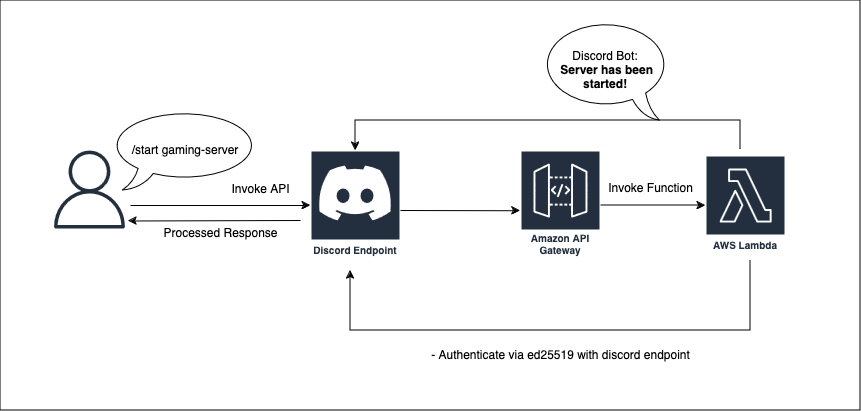

# Serverless Discord Bots with Slash Commands

As of 2021, Discord has significantly enhanced its functionality with the introduction of Discord slash commands. This new feature allows developers to create more interactive and responsive bots by forwarding events directly to specified interaction endpoint. This shift means you are no longer required to listen continuously for message events, leading to more efficient and scalable bot development.



## Embracing Serverless Architecture

With these advancements, it's now possible to utilize AWS Lambda to perform bot actions, starting lambda function only when a request is received. This method saves computing power and allows for seamless scaling based on demand. A practical demonstration of this concept is available in [this proof of concept repository](https://github.com/maanisim/serverless-discord).

### New Possibilities with Slash Commands

By using slash commands, developers can implement various functionalities such as:
- **User Verification**: Automate user verification based on criteria of your choice.
- **Game Server Initialization**: Automatically set up game servers in response to user commands.

## Architecture Overview

The simplest view of this architecture can be visualized as follows:

```
Discord -> API Gateway -> Lambda -> Discord
```

When a user performs an action, such as `/foo bar`, the request is directed to your endpoint which you can specify in [(Bot Application) > Interactions Endpoint URL](https://discord.com/developers/applications) for processing which you can declare custom responses.

To handle such requests, you need to set up an API Gateway that listens for POST requests. This gateway then performs an AWS API call (`lambda:InvokeFunction`) to invoke the specified lambda function, which than processes the request and determines the subsequent steps of your choice.

But before you do any of that, you first need to verify the authenticity of a request sent to a Discord bot or webhook using the Ed25519 public-key signature system:
```py
    verify_key = VerifyKey(bytes.fromhex(PUBLIC_KEY))
    signature = event['headers']['x-signature-ed25519']
    timestamp = event['headers']['x-signature-timestamp']

    try:
        # ed25519 check
        verify_key.verify(f'{timestamp}{event["body"]}'.encode(), bytes.fromhex(signature))
```

After which we need to respond to any attempt of verify whether the endpoint is alive:
```
        # respond to PING with PONG
        if json.loads(event['body'])['type'] == 1:
            return {"type": 1}
```

This setup ensures that your bot is both responsive and scalable, leveraging the power of serverless architecture to handle high volumes of interactions efficiently.

The introduction of slash commands by Discord marks a significant step forward for bot development. By integrating AWS Lambda and API Gateway, you can create scalable, efficient, and powerful bots that respond only when needed, optimizing resource usage and providing a seamless user experience. 

Useful links:
[Proof of concept repository](https://github.com/maanisim/serverless-discord)
[Indepth look into recieving/sending traffic to discord](https://discord.com/developers/docs/interactions/receiving-and-responding#security-and-authorization)
[Steps on registering commands with discord](https://discord.com/developers/docs/interactions/application-commands#making-a-global-command
)
