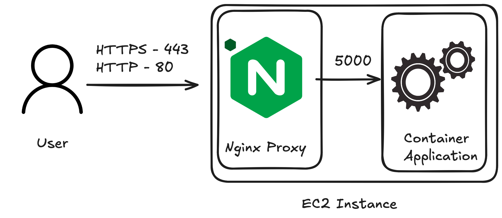

In Beanstalk ports can quickly become confusing as Nginx and Docker comes into the mix, in this article we will try to visualise the 2 primary ways of serving web traffic and their respective adavantages.

Both approaches have their own advantages, the most common way is indeed Traffic via ALB as it's easier to setup and more scalable

## Traffic via ALB

When a user tries connecting to the Elastic Beanstalk their first stop will be ALB to which traffic will be encrypted next ALB will need to forward traffic directly to the instance in a non encrypted form which will be recieved by the Reverse Proxy. On Elastic Beanstalk the default proxy is Nginx however you can configure Elastic Beanstalk to use Apache instead.

Advantages:
- There is no need to manage HTTPs certificate as it can be auto-renewed (provided that your domain is within AWS Route 53)
- (optional) You can add AWS WAF on top of the Load Balancer
- Allows for distributing the traffic more equally between the instances
- Less computing power needed as instance does not need to decrypt incoming HTTPs traffic

## Direct to instance

You can configure the terminate at instance HTTPS [in Docker via following link](https://docs.aws.amazon.com/elasticbeanstalk/latest/dg/https-singleinstance-docker.html) or for other Platform types use [this link instead](https://docs.aws.amazon.com/elasticbeanstalk/latest/dg/https-singleinstance-docker.html)

Advantages:
- More secure, as we prevent from any middleman attacks from inside of the network
- Cheaper as we do not require ALB to be present
