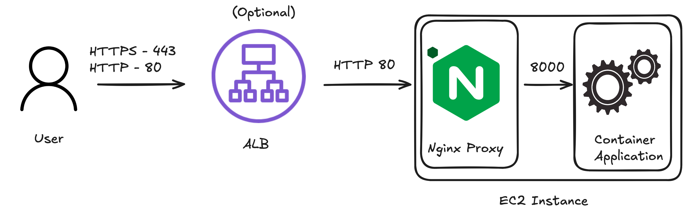

In Beanstalk's there are 2 primary ways of configuring HTTPs, we will visualise both and demistify different ports used by default.

Both approaches have their own advantages, the most common way is indeed Traffic via ALB as it's easier to setup and more scalable

## Traffic via ALB


When a user tries connecting to the Elastic Beanstalk their first stop will be ALB to which traffic will be encrypted next ALB will need to forward traffic directly to the instance in a non encrypted form which will be recieved by the Reverse Proxy. On Elastic Beanstalk the default proxy is Nginx however you can configure Elastic Beanstalk to use Apache instead.

Advantages:
- There is no need to manage HTTPs certificate as it can be auto-renewed (provided that your domain is within AWS Route 53)
- (optional) You can add AWS WAF on top of the Load Balancer
- Allows for distributing the traffic more equally between the instances
- Less computing power needed as instance does not need to decrypt incoming HTTPs traffic

You can find the ports for the Nginx which were visualised in the graph above via the 2 commands listed below


The port on which Nginx itself is listening:
```bash
$ cat /etc/nginx/nginx.conf | grep "listen 80" -A 20 -B 1
    server {
        listen 80 default_server; #<--- HERE
        gzip on;
        gzip_comp_level 4;
        gzip_types text/plain text/css application/json application/x-javascript text/xml application/xml application/xml+rss text/javascript;

        access_log    /var/log/nginx/access.log main;

        location / {
            proxy_pass            http://docker;
            proxy_http_version    1.1;

            proxy_set_header    Connection             $connection_upgrade;
            proxy_set_header    Upgrade                $http_upgrade;
            proxy_set_header    Host                   $host;
            proxy_set_header    X-Real-IP              $remote_addr;
            proxy_set_header    X-Forwarded-For        $proxy_add_x_forwarded_for;
        }

        # Include the Elastic Beanstalk generated locations
        include conf.d/elasticbeanstalk/*.conf;
    }
```

The port on which Docker Application itself should be running:
```bash
$ cat /etc/nginx/conf.d/elasticbeanstalk-nginx-docker-upstream.conf 
upstream docker {
    server 172.17.0.2:8000; #<--- HERE
    keepalive 256;
}
```

## Direct to instance


You can configure the terminate at instance HTTPS [in Docker via following link](https://docs.aws.amazon.com/elasticbeanstalk/latest/dg/https-singleinstance-docker.html) or for other Platform types use [this link instead](https://docs.aws.amazon.com/elasticbeanstalk/latest/dg/https-singleinstance-docker.html)

Advantages:
- Higher level of security, as we prevent any middleman attacks from inside of the VPC
- Cheaper as we do not require ALB to be present to serve our traffic
